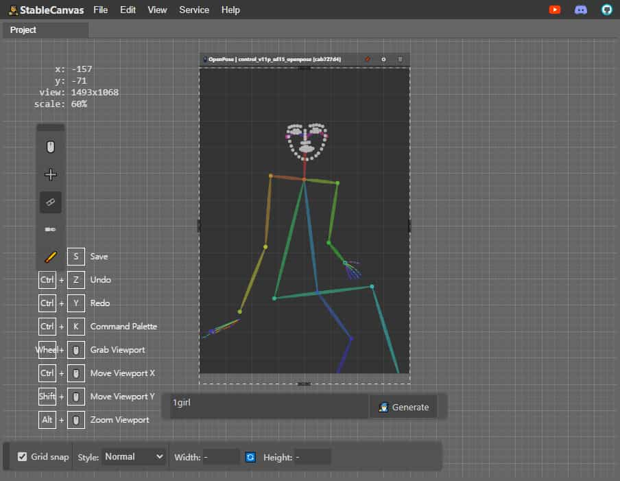

lang: [en](./README.md) | [cn](./readme.cn.md)

# StableCanvas
[StableCanvas.com](https://stablecanvas.com) 是一个免费的在线工具，用于和 stable diffusion 后端协同工作。

[](https://studio.stablecanvas.com)

> 由于 StableCanvas 不是完全开源的，因此该存储库可作为错误报告、功能请求和一般讨论的场所。

# Features

- 后端支持：支持使用 webui / comfyui 作为后端
  - 支持脚本预设：你可以自定义js脚本以对接不同的后端
- 操作简单：轻松的进行 inpaint 和 outpaint
- 无限画布：画布大小无限扩展，可以在一个项目中创建无限的作品（只要你的电脑承受的住压力）
- 拖拽布局：可拖拽调整的工作区布局
- 画布元素：画布中的元素可独立显示隐藏、pin unpin
- latent控制：对于所有可以应用到sd生成的latent进行控制（主要是CNet模块）
- pose editor：内置完善 pose editor
  - 可编辑 animal pose
  - 完整 pose 数据支持，支持 body、face、hand 数据编辑
- 应用重放：所有配置均可导入导出
  - 可以统一导出所有 feeds 为 `.zip` 文件 
- 项目文件：支持将应用状态保存为项目文件 `.scd` 文件，类似于 `.psd`
- 插件系统：可扩展的插件系统
- 扩展工具：可以快速开发扩展工具，你只需要写要给 html
  - 使用 `@stable-canvas/sdk` 包可以将你的工具与主程序链接

##   Showcase from YouTube

[](https://www.youtube.com/watch?v=lnhcBCJ_NhM&list=PLNaPKZgVE2TxkO2rc7mvXCNuTLS-uxQ6j "Showcase Youtube Playlist")

## Shortcuts

<!--
全局快捷键
- Ctrl + S: Save current editor status to project document file
- Ctrl + Z: Undo
- Ctrl + Y: Redo
- Ctrl + K: Open Command Palette
- 按下鼠标中键: 拖拽 viewport
- Ctrl + 鼠标滚轮: 在 Y 轴方向移动 viewport
- Shift + 鼠标滚轮: 在 X 轴方向移动 viewport
- Alt + 鼠标滚轮: 在 Z 轴方向移动 viewport (缩放 Viewport)

Move tool快捷键
- WASD: 移动 Viewport
- QE: 缩放 Viewport
- Shift + WASD: 快速移动 Viewport

lasso tool快捷键
- Shift: 反转蒙版画笔
- -->

<table border="1">
  <tr>
    <th>序号</th>
    <th>类别</th>
    <th>快捷键</th>
    <th>功能</th>
  </tr>
  <tr>
    <td>1</td>
    <td rowspan="8">全局快捷键</td>
    <td>Ctrl + S</td>
    <td>保存当前编辑器状态到项目文档文件</td>
  </tr>
  <tr>
    <td>2</td>
    <td>Ctrl + Z</td>
    <td>撤销</td>
  </tr>
  <tr>
    <td>3</td>
    <td>Ctrl + Y</td>
    <td>重做</td>
  </tr>
  <tr>
    <td>4</td>
    <td>Ctrl + K</td>
    <td>打开命令面板</td>
  </tr>
  <tr>
    <td>5</td>
    <td>按下鼠标中键</td>
    <td>拖拽 Viewport</td>
  </tr>
  <tr>
    <td>6</td>
    <td>Ctrl + 鼠标滚轮</td>
    <td>在 Y 轴方向移动 Viewport</td>
  </tr>
  <tr>
    <td>7</td>
    <td>Shift + 鼠标滚轮</td>
    <td>在 X 轴方向移动 Viewport</td>
  </tr>
  <tr>
    <td>8</td>
    <td>Alt + 鼠标滚轮</td>
    <td>缩放 Viewport</td>
  </tr>
  <tr>
    <td>9</td>
    <td rowspan="3">Move tool</td>
    <td>W/A/S/D</td>
    <td>移动 Viewport</td>
  </tr>
  <tr>
    <td>10</td>
    <td>Q/E</td>
    <td>缩放 Viewport</td>
  </tr>
  <tr>
    <td>11</td>
    <td>Shift + W/A/S/D</td>
    <td>快速移动 Viewport</td>
  </tr>
  <tr>
    <td>12</td>
    <td rowspan="1">lasso tool</td>
    <td>Shift</td>
    <td>反转蒙版画笔</td>
  </tr>
</table>

##  配置

###  基于 A1111/WebUI

本程序推荐你使用 a1111 webui 作为后端，因为这几乎是 stable diffusion 开源社区中的事实标准。

要使用 a1111 webui 作为后端是非常简单的，大体上你可以依据下面几个步骤开始你的后端配置：

1. 拉取 a1111 webui 代码仓库 
   - （建议使用 [1.8.0版本](https://github.com/AUTOMATIC1111/stable-diffusion-webui/releases/tag/v1.8.0) ，1.9.x版本未经过本程序完全测试不保证能正常使用）
2. 下载并配置你的模型、lora、embedding
3. **KEY STEP**: 启动时，请在启动参数中添加 ```--cors-allow-origins``` 和 ```--api```
   1. 你可以配置为 ```--cors-allow-origins=*```
   2. 或者仅仅支持本程序调用 ```--cors-allow-origins=studio.stablecanvas.com```
4. 打开本程序，在 ```Service``` 菜单中 ```Clients``` 内，配置并测试你的后端是否联通

###  基于 ComfyUI

由于 ComfyUI 的开发便利性，现在已经很多人从 webui 迁移到 ComfyUI 中进行使用。当然本程序调用 ComfyUI 也是非常简单的。

配置启动项：
- 添加 `--enable-cors-header=*` 到你的 ComfyUI 启动项中，以允许 StableCanvas 通过网页调用 api

配置工作流：
有以下3种方式可以配置 ComfyUI Workflow：

1. 使用内置 ComfyUI 预设
   - 本程序自带一个 ComfyUI 预设，你仅仅需要配置 后端地址 即可。
2. 自定义 ComfyUI 预设
   - 由于 ComfyUI 的便利性，你完全可以自定义一个新的工作流用于本程序的调用。
   - 你可以参考下面的这个 Workflow 进行进一步开发：


需要注意的是，在编辑时请保留其中的 `<%- slot_name %>` 字符串插槽，这会在 api 调用时替换为请求内容。

> 当你决定自己配置 ComfyUI 的时候，由于 ComfyUI 不支持一些常见的编程节点所以...你可能需要配置三套 workflow 才可以无缝的完整的使用本程序，具体可以检查 ComfyUI Demo 代码。

3. 编写自定义的调用脚本
   - 如果你需要完全定制的后端调用（比如使用自定义的python后端时），你完全可以从零开始编写 预设脚本 。

在 [welcome.cn.md](./welcome.cn.md) 的 preset 栏目中会详细介绍。

# Contact Us
- :envelope: Support@StableCanvas.com
